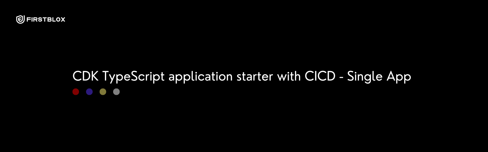
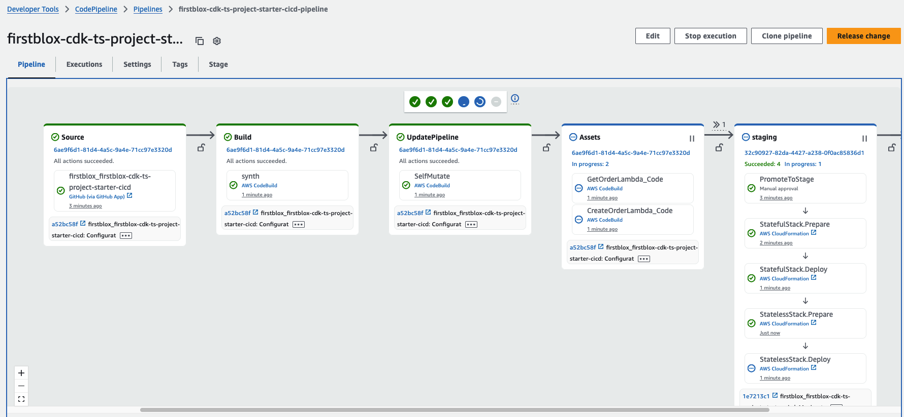

firstblox-cdk-ts-project-starter-cicd
-------------------------------------

# Table of Contents

[Overview](#overview)

[Install](#install)

[Configure](#configure)

[Development](#deployment)

[Deployment](#deployment)

# Overview



> [!NOTE]
> This codebase utilises concepts and reference code from the excellent series by Lee Gilmore on CDK pipelines best practices.
> See part 1 [here](https://github.com/leegilmorecode/Serverless-AWS-CDK-Best-Practices-Patterns).
> I highly recommend you checkout the whole series.

> [!IMPORTANT]
> This codebase is currently a reference repository ONLY.
> Developers should customise to their environment and requirements.
> See `src/config/index.ts` for all configurations

**Whats included?**

- Projen CDK TS project scaffolding.
- Seperate CDK app entrypoint for feature developement and to facilitate the creation of developer sandboxes.
- Seperate CDK app entrypoint for the develop branch and to manage the dev pipeline.
- Seperate CDK app entrypoint for the main branch and to manage the path to production pipeline.
- Pipeline stack for main.
- Pipeline stack for develop.
- Stateful stack with sample stateful resources.
- Stateless stack with sample APIGW and sample Lambda handlers.
- Application stage encapsulating application stacks a deployable unit.
- Configuration file for dynamic loading of environment configurations.
- Auto generation of deployment stages via CDK pipelines.
- Optional dynamic fetching of SSM stored aws account ids.

**Pre-requisites**

- CDK CLI installed.
- Projen installed.
- AWS account CDK bootstrapped.
- Sufficient credentials to perform deployment from local.

# Install

## Initial installation

Ensure pnpm is installed.

```bash
npm install -g pnpm
```

Install dependencies.

```bash
pnpm i
```

## Adding dependencies

Any new dependencies must be added to `.projenrc` at the root of the project.

## Using Projen

Once the initial installation of dependencies complete, in order to keep all project configuration files and dependencies in sync, each time `.projenrc` is updated run the following command.

```
npx projen
```

# Configure

## Projen

To configure the project and project dependencies please modify `.projenrc` ONLY.

A good rule of thumb:

- Utilise projenrc in all cases where projen supports a configuration action/type.
- Apply a manual addition/change in cases where projen does not support a configuration action/type or it cannot be customised through projen.

Once configuration changes are made via `.projenrc` run the below command.

```bash
npx projen
```

## Fetch Accounts

### Option 1 - Dynamically fetch account ids

If you want to avoid hardcoding account ids in configuration code, optionally you can store your account ids in SSM in the account in which your CodePipeline will reside.

Once stored they can be dynamically fetched both locally and in a pipeline context.

During dynamic fetching they are written to `.env`.

**SSM account id format**

An SSM parameter per account id you are working with must be created.

Currently the format for the name of these parameters is as follows:

```bash
/accountId/pipeline
```

These parameters must reside in the same AWS account as you intend to provision your pipeline.

**Configuring accountId names**

Open `.projenrc` to modify environment names or indeed account names.

Running `npx projen` updates [src/config/account-ids.ts](./src/config/account-ids.ts).

Dynamic fetching reads from this file to peform lookups.

**Enabling dynamic fetching of accounts**

Open [src/config/index.ts](./src/config/index.ts) and modify the pipelineConfig property `dynamicAccounts`.

E.g.

```typescript
export const pipelineConfig: PipelineConfig = {
  env: {
    account: accountIdConfig.pipeline,
    region: Region.dublin,
  },
  github: {
    owner: "firstblox",
    repository: "firstblox-cdk-ts-project-starter-cicd",
    branch: "main",
  },
  codeStarConnectionName: "project-starter-connection",
  pipelineName: `${PROJECT_NAME}-pipeline`,
  dynamicAccounts: true,
  useChangeSets: true,
  selfMutation: true,
};
```

### Option 2 - Specify actual account ids in config.

Open [src/config/index.ts](./src/config/index.ts) and:

1. Set `dynamicAccounts: false`
2. modify the `accountIdConfig` with actual accountIdConfig for your target environment

E.g.

```typescript
export const accountIdConfig: AccountId = {
  pipeline: "111111111111",
  dev: "222222222222",
  qa: "333333333333",
  staging: "444444444444",
  prod: "555555555555",
};
```

> [!NOTE]
> If your environments or account identifiers are different you can add/remove/update the account ids enum in [src/config/types.ts](./src/config/types.ts) and align your environment config accordingly.

# Development

## Configure

Create or update a `.env` file at the root of the project with the following configurations.

```bash
TARGET_ACCOUNT_ID=XXXXXXXXXXXX
TARGET_REGION=eu-west-1
STAGE=lofcodes
```

## AWS Credentials

Setup aws credentials for your target AWS development account using your preferred method.

## Feature Development

### Synth

```bash
STAGE=lofcodes npx projen feature-dev synth
```

### Deploy

```bash
STAGE=lofcodes npx projen feature-dev deploy --all
```

### Destroy

```bash
STAGE=lofcodes npx projen feature-dev deploy --all
```

## Develop Pipeline -> Dev Environment

### Synth

```bash
npx projen develop synth
```

### Deploy

```bash
npx projen develop deploy --all
```

### Destroy

```bash
npx projen develop deploy --all
```

## Main pipeline -> "Path to Production"

### Synth

```bash
npx projen synth
```

### Deploy

```bash
npx projen deploy --all
```

### Destroy

```bash
npx projen deploy --all
```

## Approvals

**Note: The deployment may have manual approval stages. Ensure to approve the deployment at that stage if so.**

Manual approvals are configured in [pipeline.stack.ts](./src/pipeline/stack/pipeline.stack.ts) as follows

```typescript
const stagingStage: PipelineStage = new PipelineStage(this, "Stage", {
  ...environments.staging,
});
pipeline.addStage(stagingStage, {
  pre: [new pipelines.ManualApprovalStep("PromoteToStage")],
});
```

## Pipeline Output

Once deployed your new CodePipeline should look something like the following.

